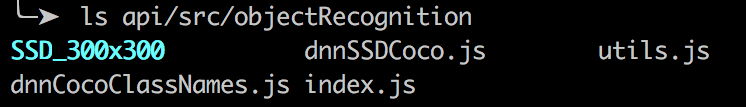

# ObjectRecognition

Object Recognition Api with client using opencv4nodejs.

## Getting Started

### Prerequisites

- Download SSD model trained

  https://drive.google.com/drive/folders/1JrdwAGz7jwahCO66ricufqeb2GmntWhP?usp=sharing

- Install docker on your machine.

  https://www.docker.com/

### Installing

#### Place SSD file:

Move SSDmodel trained file in api/src/ObjectRecognition folder he must be called SSD_300x300



#### Build the image:

```
docker-compose build
```

#### Run:

```
docker-compose up
```

## Built With

- [React-boilerplate](https://github.com/react-boilerplate/react-boilerplate) - Used to generate client
- [Opencv4nodejs](https://github.com/justadudewhohacks/opencv4nodejs) - Library used for API

## Authors

- **Lange Julien**

## License

This project is licensed under the WTFPL License - see the [LICENSE.md](LICENSE.md) file for details
